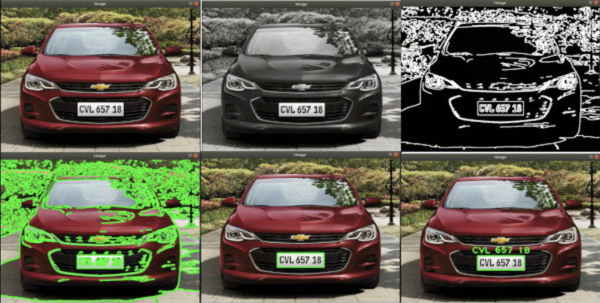

## Introducción

Este proyecto desarrolla un sistema de **Detección y Reconocimiento Automático de Matrículas (ALPR)** orientado a su uso desde un **vehículo policial**. El sistema utiliza **técnicas de visión artificial y aprendizaje profundo** para identificar matrículas de vehículos de cuatro ruedas capturadas mediante una cámara instalada en el coche patrulla. El procesamiento se ejecuta sobre una **Raspberry Pi**, que actúa como unidad de captura y análisis de imágenes.

Una vez detectada y reconocida la matrícula, el sistema realiza **consultas en diferentes bases de datos** con el objetivo de comprobar posibles incidencias asociadas al vehículo, como por ejemplo que esté **reportado como robado, tenga multas pendientes o no disponga de la ITV vigente**. De esta forma, los agentes de policía pueden obtener **información rápida y automática durante las labores de patrullaje**.

El proyecto contempla el desarrollo de un **prototipo funcional** capaz de detectar y reconocer matrículas de vehículos estacionados en parkings de la vía pública. Además del sistema implementado, el proyecto incluye la **documentación de requisitos, el repositorio del código y los elementos necesarios para la evaluación del sistema**.





## Mockup del sistema principal

El siguiente mockup muestra una posible interfaz del sistema de detección y reconocimiento automático de matrículas utilizado desde un vehículo policial.

```text
+------------------------------------------------------+
| SISTEMA DE DETECCIÓN DE MATRÍCULAS - VEHÍCULO POLICIAL |
+------------------------------------------------------+

INTERFAZ
--------------------------------------------------------
|                                                      |
|                                                      |
|            [ Imagen capturada del vehículo ]         |
|                                                      |
|                                                      |
|                                                      |
|           Matrícula detectada: 1234 ABC              |
|           Nivel de confianza: 92 %                   |
|                                                      |
--------------------------------------------------------

Información del vehículo
--------------------------------------------------------
Vehículo robado:        ❌ No
Multas pendientes:      ⚠️ Sí
ITV vigente:            ❌ No
--------------------------------------------------------

Estado del sistema
--------------------------------------------------------
Dispositivo: Raspberry Pi
Modelo de detección: YOLO / OCR
Base de datos: Vehículos e incidencias
--------------------------------------------------------
```