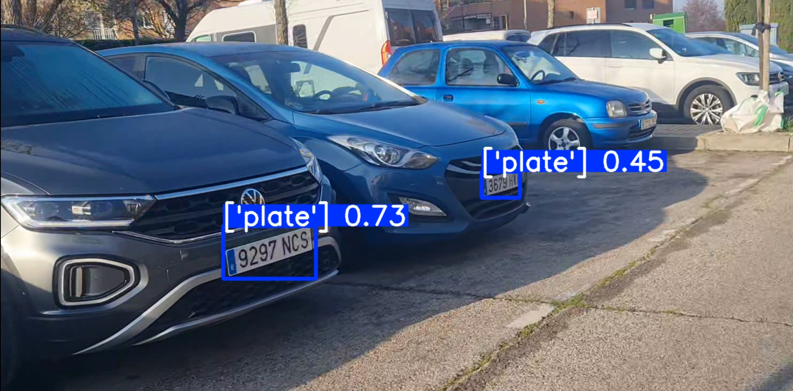

## Introducción

Este proyecto desarrolla un sistema de **Detección y Reconocimiento Automático de Matrículas (ALPR)** orientado a su uso desde un **vehículo policial**. El sistema utiliza **técnicas de visión artificial y aprendizaje profundo** para identificar matrículas de vehículos de cuatro ruedas capturadas mediante una cámara instalada en el coche patrulla. El procesamiento se ejecuta sobre una **Raspberry Pi**, que actúa como unidad de captura y análisis de imágenes.

Una vez detectada y reconocida la matrícula, el sistema realiza **consultas en diferentes bases de datos** con el objetivo de comprobar posibles incidencias asociadas al vehículo, como por ejemplo que esté **reportado como robado, tenga multas pendientes o no disponga de la ITV vigente**. De esta forma, los agentes de policía pueden obtener **información rápida y automática durante las labores de patrullaje**.

El proyecto contempla el desarrollo de un **prototipo funcional** capaz de detectar y reconocer matrículas de vehículos estacionados en parkings de la vía pública. Además del sistema implementado, el proyecto incluye la **documentación de requisitos, el repositorio del código y los elementos necesarios para la evaluación del sistema**.





## Mockup del sistema principal

El siguiente mockup muestra una posible interfaz del sistema de detección y reconocimiento automático de matrículas utilizado desde un vehículo policial.

```text
+------------------------------------------------------+
| SISTEMA DE DETECCIÓN DE MATRÍCULAS - VEHÍCULO POLICIAL |
+------------------------------------------------------+

INTERFAZ
--------------------------------------------------------
|                                                      |
|                                                      |
|                                                      |
|            [ Imagen capturada del vehículo ]         |
|                                                      |
|                                                      |
|                                                      |
|                                                      |
|           Matrícula detectada: 1234 ABC              |
|                                                      |
--------------------------------------------------------

Información del vehículo
--------------------------------------------------------
Marca del Vehículo:     TESLA
Vehículo robado:        ❌ No
Multas pendientes:      2
ITV vigente hasta:      04-06-2028      
--------------------------------------------------------

Estado del sistema
--------------------------------------------------------
Dispositivo: Raspberry Pi
Modelo de detección: YOLO / OCR
Base de datos: Vehículos e incidencias
--------------------------------------------------------
```

## Requisitos previos

Para ejecutar este proyecto es necesario disponer de Python 3.12 instalado en el sistema, así como de pip para la gestión
de dependencias. Además, se recomienda trabajar dentro de un entorno virtual para evitar conflictos con otras librerías 
instaladas en el equipo.

Las principales bibliotecas utilizadas en el proyecto son ultralytics, para la detección de matrículas mediante YOLO; 
easyocr, para el reconocimiento de caracteres; opencv-python, para la captura y procesamiento de imágenes y vídeo; numpy, 
para la manipulación de arrays y datos numéricos; torch y torchvision, como base para la ejecución de los modelos de deep learning; 
y pytest, para la ejecución de pruebas automáticas.

Estas dependencias pueden instalarse automáticamente ejecutando el siguiente comando en la raíz del proyecto:

```
pip install -r requirements.txt
```

## Cómo clonar el repositorio

El código fuente del proyecto se encuentra alojado en GitHub. Para descargarlo en local, primero se debe clonar el 
repositorio con el siguiente comando:
```
git clone https://github.com/AndresCuichanFlores/AIVA_2026-MUVA.git
```
Una vez descargado, se accede a la carpeta principal del proyecto mediante:
```
cd AIVA_2026-MUVA
```
La rama main contiene la versión más actualizada y estable del proyecto, por lo que se recomienda trabajar sobre ella:
```
git checkout main
```

## Ejecución del proyecto

Una vez clonado el repositorio y situados en la carpeta del proyecto, se debe acceder al directorio system/src, donde 
se encuentra el archivo principal de ejecución. Desde ahí, el sistema puede iniciarse mediante el siguiente comando:

```
python main.py
```

Este script lanza el sistema completo de reconocimiento automático de matrículas (ALPR). El vídeo a procesar se especifica
directamente en el código, modificando manualmente la variable correspondiente a la ruta del vídeo (video_path) dentro del
archivo main.py.

Una vez configurada la ruta, el sistema procesa el vídeo frame a frame, detectando matrículas, reconociendo el texto 
mediante OCR y mostrando la información asociada a cada vehículo detectado en el terminal.

## Ejecución de tests

El proyecto incluye pruebas unitarias que permiten verificar el correcto funcionamiento de los principales componentes 
del sistema ALPR, como el flujo completo de detección y reconocimiento de matrículas.

Para ejecutar los tests, es necesario situarse en el directorio system/tests y lanzar el siguiente comando:

```
python -m pytest test_detection_and_recognition.py
```

Este archivo de test incluye varias pruebas: una centrada en la detección de matrículas mediante YOLO, otra en el 
reconocimiento de texto mediante OCR, y una última que valida el flujo completo del sistema, desde la detección hasta 
el reconocimiento final de la matrícula. De este modo, se asegura que tanto los módulos individuales como la integración 
entre ellos funcionan correctamente.